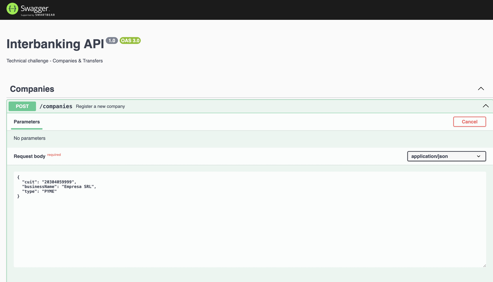
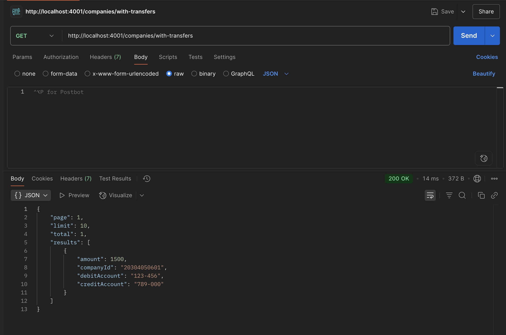
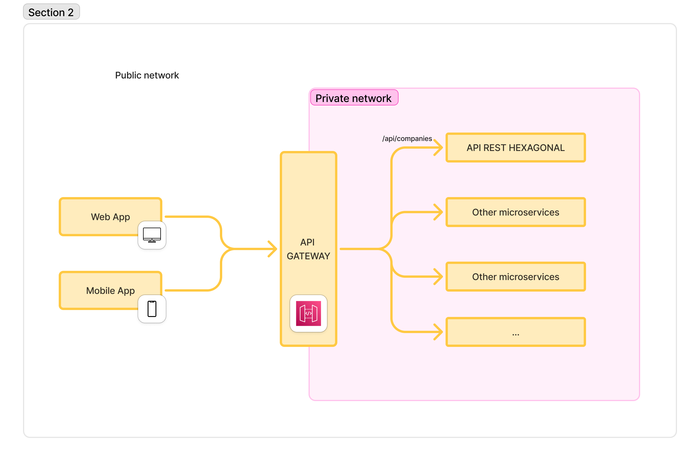
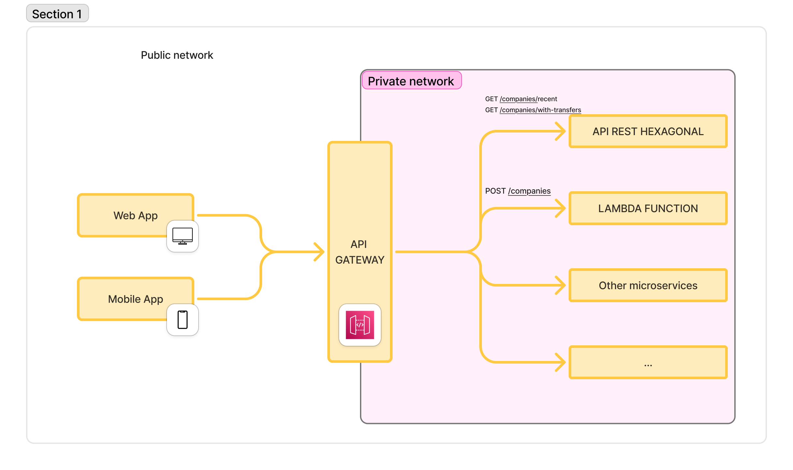

# Desafío Técnico Interbanking – Backend

Este proyecto incluye dos partes:

1. API RESTful desarrollada con NestJS y arquitectura hexagonal.  
2. Función Lambda en AWS que simula el alta de una empresa.

---

## Parte 1 – API REST con NestJS (Arquitectura Hexagonal)

### Stack tecnológico

- Node.js: **v20.17.0**
- NestJS: **v11**
- TypeScript: **v5.8.3**
- Swagger (Documentación de API)
- In-memory storage
- Arquitectura hexagonal (Domain → Application → Infrastructure)

### Endpoints

| Método | Endpoint                      | Descripción                                 |
|--------|-------------------------------|---------------------------------------------|
| POST   | `/companies`                  | Alta de nueva empresa                       |
| GET    | `/companies/with-transfers`   | Empresas con transferencias en el último mes |
| GET    | `/companies/recent`           | Empresas adheridas recientemente            |
| GET    | `/health`                     | Health check                                |

---

### Campos utilizados (mapeo Español ↔ Inglés)

| Español         | Inglés         |
|----------------|----------------|
| CUIT           | `cuit`         |
| Razón social   | `businessName` |
| Tipo           | `type`         |
| Cuenta débito  | `debitAccount` |
| Cuenta crédito | `creditAccount` |
| Importe        | `amount`       |

---

### Cómo correr localmente

Dirigirme desde la terminal a la carpeta del proyecto "api-endpoints" y ejecutar los siguientes comandos:

```bash
npm install
npm run start:dev
```

### Variables de entorno

`.env` (ejemplo):

```
PORT=3000
```

El puerto por defecto es `3000`, no es obligatorio definirlo en el archivo `.env`.

---

### Tests

```bash
npm run test:e2e 
```

---
---

## Ejemplos de llamadas

### 1. Alta de empresa (POST /companies)

**Request:**

```bash
curl -X POST http://localhost:3000/companies \
  -H "Content-Type: application/json" \
  -d '{
    "cuit": "20304050601",
    "businessName": "Mi Empresa SRL",
    "type": "PYME"
  }'
```

**Response esperado (201):**

```json
{
  "message": "Company registered successfully"
}
```

---

### 2. Obtener empresas con transferencias

**Request:**

```bash
curl http://localhost:3000/companies/with-transfers?page=1&limit=10
```

**Response:**

```json
{
  "page": 1,
  "limit": 10,
  "total": 2,
  "results": [
    {
      "amount": 5000,
      "companyId": "20304050601",
      "debitAccount": "123456789",
      "creditAccount": "987654321"
    }
  ]
}
```

---

### Documentación Swagger

Accesible en:

```
http://localhost:3000/docs
```

Incluye:
- Ejemplos de body válidos e inválidos
- Esquemas tipados
- Paginación

## Capturas de pantalla

### Vista en Swagger



### Prueba en Postman



---

## ☁️ Parte 2 – Lambda AWS

### Descripción

Función Lambda que simula la adhesión de una empresa. Valida campos, controla duplicados por CUIT y simula persistencia en memoria.

---
---
### Stack tecnológico

- Node.js: **v20.17.0**
- Serverless Framework: **v4.17.1**

---

### Ubicación

```bash
/lambda/company-registration.ts
```

---

### Probar localmente

Dirigirme desde la terminal a la carpeta del proyecto "lambda-company" y ejecutar los siguientes comandos:

```bash
npm run lambda:dev
```

Usar este endpoint:

```
POST http://localhost:3000/companies
```

Body:

```json
{
  "cuit": "20304050601",
  "businessName": "Empresa SRL",
  "type": "PYME"
}
```

---

### 🧬 Ejemplo de respuesta

**Éxito (201)**

```json
{
  "message": "Company registered successfully"
}
```

**Error (409 - duplicado)**

```json
{
  "message": "Company already exists"
}
```

---

### Integración esperada

Esta Lambda replica la lógica del endpoint `POST /companies` desarrollado en la API REST.  
Puede integrarse de forma directa mediante API Gateway, ser invocada por otra función Lambda, una cola (SQS) o un evento. Su responsabilidad es validar el alta de empresas desde una arquitectura sin servidor, permitiendo desacoplar esta operación de un backend tradicional.

Esta Lambda puede utilizarse como reemplazo directo del endpoint REST `POST /companies` si se opta por una arquitectura completamente serverless.

Se adjuntan diagramas que reflejan el antes y después de la integración de la Lambda con el API Gateway y su convivencia con la API REST.


### Diagrama 1 – Enrutamiento clásico a microservicios
Este es el esquema original, donde todos los endpoints (GET, POST, etc.) son resueltos por los microservicios que viven en una red privada, accedidos únicamente a través del Gateway.




### Diagrama 2 - Reemplazo de Endpoint REST con Lambda
En este esquema, el API Gateway enruta los métodos GET hacia el microservicio REST tradicional, mientras que el método POST /companies es delegado a una función Lambda, que cumple con la misma responsabilidad (registro de empresas), pero desacoplado del backend principal.

